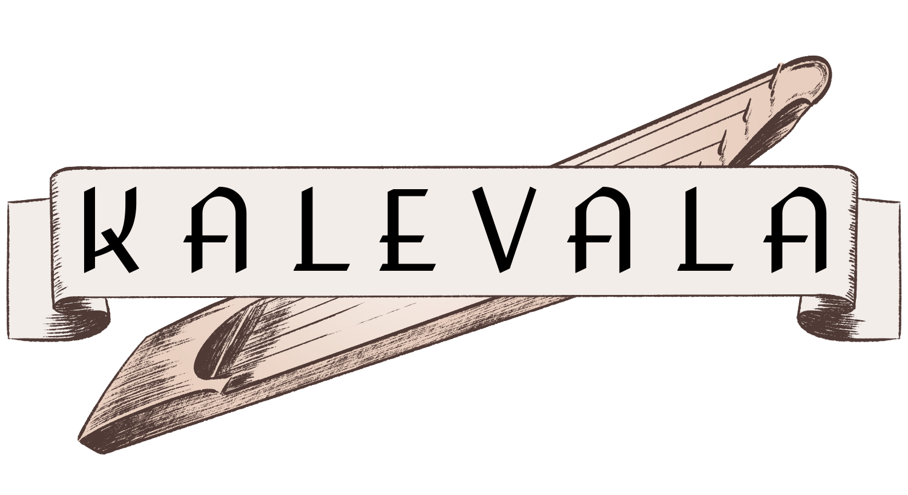

# Kalevala



Kalevala is a world building toolkit for text based games, written in Elixir.

## Example Game

There is an example game, Kantele, in the `example/` folder.

To start the game:

```bash
cd example/
mix deps.get
mix compile
cd assets/
yarn install
yarn build
cd ..
mix run --no-halt
```

A telnet listener will start on port `4444` and a TLS listener will start on port `4443` with a self signed cert. A web client will start on port `4500`, visit `http://localhost:4500/` to view it in your browser.

## Components of Kalevala

### Foreman

When you connect, a new `Kalevala.Character.Foreman` process is started. This process handles incoming text from the player, sending out going text and events, and other orchestration.

### Conn

A `Kalevala.Character.Conn` is the context token for controllers and commands. This is similar to a `Plug.Conn`. The main difference being it bundles up multiple renders and events to fire all at once, instead of being used for a single request.

The foreman will generate new `Conn`s before each event or incoming text. After processing the `Conn`, it is processed by sending text to the player and events sent to their router (more on this in a bit).

### Controllers

A `Kalevala.Character.Controller` is the largest building block of handling texting. When starting the foreman, an initial controller is given. This controller is initialized and used from then on. The callbacks required will be called at the appropriate time with a new `Conn`.

Controllers act as a simple state machine, only allowing transitioning to the next one you set in the `Conn`. For instance, you can contain all login logic in a `LoginController`, and handle game commands in its own controller, any paging can be handled in a `PagerController` which can suppress any outgoing text to prevent scrolling while reading, etc.

```elixir
defmodule Kantele.Character.CommandController do
  use Kalevala.Character.Controller

  require Logger

  alias Kantele.Character.Commands
  alias Kantele.Character.CommandView

  @impl true
  def init(conn), do: prompt(conn, CommandView, "prompt", %{})

  @impl true
  def recv(conn, ""), do: conn

  def recv(conn, data) do
    Logger.info("Received - #{inspect(data)}")

    case Commands.call(conn, data) do
      {:error, :unknown} ->
        conn
        |> render(CommandView, "unknown", %{})
        |> prompt(CommandView, "prompt", %{})

      conn ->
      prompt(conn, CommandView, "prompt", %{})
    end
  end
end
```

### Commands

A `Kalevala.Character.Command` is similar to a `Controller`, but should be called from a `Controller` through a `Command.Router`. Incoming text can be pattern matched in the router and be processed.

In the example below, you can `Kantele.Character.Commands.call(conn, "say hello")` to run the `SayCommand.run/2` function.

```elixir
defmodule Kantele.Character.Commands do
  use Kalevala.Character.Commands.Router

  scope(Kantele) do
    module(SayCommand) do
      command("say :message", :run)
    end
  end
end

defmodule Kantele.Character.SayCommand do
  use Kalevala.Character.Command

  def run(conn, params) do
    params = %{
      "name" => character(conn).name,
      "message" => params["message"]
    }

    conn
    |> render(SayView, "echo", params)
    |> event("room/say", params)
  end
end
```

### Views

A `Kalevala.Character.View` renders text and out of band events to the player. These are strings, IO data lists, or `Kalevala.Character.Conn.Event` structs (which are used for GMCP in telnet.)

The sigil `~i` keeps a string as an IO data list, which is faster for processing and should be used if any interpolation is needed. Larger views can use the sigil `~E` to use EEx.

```elixir
defmodule Kantele.Character.SayView do
  use Kalevala.Character.View

  import IO.ANSI, only: [reset: 0, white: 0]

  def render("echo", %{"message" => message}) do
    ~i(You say, "\e[32m#{message}\e[0m"\n)
  end

  def render("listen", %{"character_name" => character_name, "message" => message}) do
    ~i(#{white()}#{character_name}#{reset()} says, "\e[32m#{message}\e[0m"\n)
  end
end
```

### Events

A `Kalevala.Event` is an internal event passed between processes. Events have three fields, which pid is generating the event, the topic (e.g. `room/say`), and a map of data. Controllers and commands can generate events which will get sent to an event router process, which is typically the room they are in.

The `Kalevala.World.Room` process handles the event by running the event through a similar router to command processing. The `Foreman` process handles events with its own event router.

In the example below, you can call the event router with an event of topic `room/say` to run the `Kantele.World.Room.NotifyEvent.call/2` function.

```elixir
defmodule Kantele.World.Room.Events do
  @moduledoc false

  use Kalevala.Event.Router

  scope(Kantele.World.Room) do
    module(NotifyEvent) do
      event("room/say", :call)
    end
  end
end

defmodule Kantele.World.Room.NotifyEvent do
  import Kalevala.World.Room.Context

  def call(context, event) do
    Enum.reduce(context.characters, context, fn character, context ->
      event(context, character.pid, event.from_pid, event.topic, event.data)
    end)
  end
end
```

### Actions

A `Kalevala.Character.Action` is a small set of functionality that a character can perform. Think of this as an "atom" building block that you can piece together other commands and the behavior tree below together with.

Actions have a single function `run/2`. They accept a `conn` and `params` as commands and controllers do.

The example below bundles together what it means to speak into a channel, e.g. the room your character is in.

```elixir
defmodule Kantele.Character.SayAction do
  @moduledoc """
  Action to speak in a channel (e.g. a room)
  """

  use Kalevala.Character.Action

  alias Kantele.Character.SayView

  @impl true
  def run(conn, params) do
    conn
    |> assign(:text, params["text"])
    |> render(SayView, "echo")
    |> publish_message(params["channel_name"], params["text"], [], &publish_error/2)
  end

  def publish_error(conn, _error), do: conn
end
```

### Character "Brains" - Behavior Tree

In order to create non-player characters, you can equip them with a brain of sorts. This comes in the form of a simple behavior tree. The tree evaluates an incoming event and checks to see which branches/leaves trigger.

#### Selectors

- `FirstSelector`, starts at the top and tries each node, continuing until the first node succeeds
- `ConditionalSelector`, starts at the top and tries each node, continuing as long as nodes succeed
- `RandomSelector`, selects a random node to process
- `Sequence`, starts at the top and runs each node, ignoring failing nodes

#### Leaves

- `Condition`, a node that evaluates the condition, if the condition is `false`, then the node fails, generally this is matched with a `ConditionalSelector` at the start to fail the actions below it
- `Action`, a node that will append an action to the conn to be performed, optionally delayed
- `NullNode`, a no-op node that can be used as an empty brain to skip node operation

#### Conditions

- `MessageMatch`, built-in condition to match a `Kalevala.Event.Message` event
- `EventMatch`, built-in condition to match a base `Kalevala.Event` event

### Communication & Channels

A `Kalevala.Communication.Channel` is a pub/sub for sending chat messages between characters. Channels are registered with a callback module, allowing for callbacks before subscriptions/unsubscriptions/publishes.

For instance, rooms can register a channel for themselves, and as characters move around they can change room subscriptions. A `say` command can then publish to this room, with every other character in the room receiving the event via their subscription. Another example might be a global channel that all characters are subscribed to, or one for a set of characters.

By default, the `use` macro will fill in default implementations that allow all.

```elixir
defmodule Kantele.Communication.BroadcastChannel do
  use Kalevala.Communication.Channel
end

defmodule Kantele.Communication do
  @moduledoc false

  use Kalevala.Communication

  @impl true
  def initial_channels() do
    [{"general", Kantele.Communication.BroadcastChannel, []}]
  end
end
```

### The World

The world in Kalevala consists of `Kalevala.World.Zone`s and `Kalevala.World.Room`s. A zone contains many rooms, and rooms are the basic block of traversing the world. Rooms also act as the primary point of work (processing events) as all events will go through the room that characters are in.

The example game boots the world from flat files, but world data can come from any source as long as the structures can be created. For instance, you might load a simple zone struct with a database ID and hydrate the zone after the process started.
